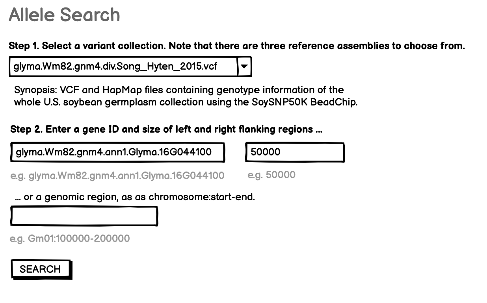

# Allele search query - to find variants (generally SNPs) around a gene or in a region, within a specified variant collection

This is the initial/draft requirements doc for the SoyBase allele search, to be implemented on the respective Jekyll web sites. This search component should enable search of specified variant collections (VCF files) in the vicinity of a specified gene or within a specified region. 
Note that the specification is for SoyBase first, partly because many VCF files are available for soybean. The specification and implementation may be generalized later for use with other species at LIS and PeanutBase.

## Specification version
Version: 0.6.0

<details>

The initial draft of this document (0.5.0), 2024-07-18, is essentially for a prototype implementation, probably using a combination of the GCV microservices to return gene coordinates and the fasta-api services to return alleles from a range in a VCF. The first implementation will probably be done in in-page javascript rather than in a web component, since the GraphQL schema is not yet described for fasta-api.

Some tweaks on 2024-07-25 (0.6.0), removing "Genes in this region" from the results.

</details>

## Input
A variant collection, as a VCF file
```
# Variant collections for assembly Wm82.a2 / Wm82.gnm2.ann1.RVB6
  Filename                                    ;                    Variant Collection                       ; Annotation Collection
  glyma.Wm82.gnm2.div.Song_Hyten_2015.vcf.gz ;                     Wm82.gnm2.div.Song_Hyten_2015            ; Wm82.gnm2.ann1.RVB6
  glyma.Wm82.gnm2.div.Torkamaneh_Laroche_2017.SNPdata.vcf.gz ;     Wm82.gnm2.div.Torkamaneh_Laroche_2017    ; Wm82.gnm2.ann1.RVB6
  glyma.Wm82.gnm2.div.Torkamaneh_Laroche_2019.NonSynSNPs.vcf.gz ;  Wm82.gnm2.div.Torkamaneh_Laroche_2019    ; Wm82.gnm2.ann1.RVB6
  glyma.Wm82.gnm2.div.Torkamaneh_Laroche_2019.SNPdata.vcf.gz ;     Wm82.gnm2.div.Torkamaneh_Laroche_2019    ; Wm82.gnm2.ann1.RVB6
  glyma.Wm82.gnm2.div.Valliyodan_Brown_2021.USB481.vcf.gz ;        Wm82.gnm2.div.Valliyodan_Brown_2021      ; Wm82.gnm2.ann1.RVB6
  glyma.Wm82.gnm2.div.Wickland_Battu_2017.SNPdata1.vcf.gz ;        Wm82.gnm2.div.Wickland_Battu_2017        ; Wm82.gnm2.ann1.RVB6
  glyma.Wm82.gnm2.div.Wickland_Battu_2017.SNPdata2.vcf.gz ;        Wm82.gnm2.div.Wickland_Battu_2017        ; Wm82.gnm2.ann1.RVB6
  glyma.Wm82.gnm2.div.Wickland_Battu_2017.SNPdata3.vcf.gz ;        Wm82.gnm2.div.Wickland_Battu_2017        ; Wm82.gnm2.ann1.RVB6
  glyma.Wm82.gnm2.div.Zhang_Jiang_2020.SNPdata_full.vcf.gz ;       Wm82.gnm2.div.Zhang_Jiang_2020           ; Wm82.gnm2.ann1.RVB6
  glyma.Wm82.gnm2.div.Zhang_Jiang_2020.SNPdata_maf01.vcf.gz ;      Wm82.gnm2.div.Zhang_Jiang_2020           ; Wm82.gnm2.ann1.RVB6

# Variant collections for assembly Wm82.a4 / Wm82.gnm4.ann1.T8TQ
  glyma.Wm82.gnm4.div.Song_Hyten_2015.vcf.gz ;                     Wm82.gnm4.div.Song_Hyten_2015            ; Wm82.gnm4.ann1.T8TQ
```

... and either 
- Gene ID, with prefix, e.g. "glyma.Wm82.gnm4.ann1.Glyma.16G044100" and size of left and right flanking regions (e.g. 50000)
or
- Genomic region, as chromosome:start-end, e.g. "Gm01:100000-200000"

- SEARCH button

Examples are shown below each text input element. (Selectors are self-explanatory.)

### Mockup



<hr><br>


<hr><br>


## Implementation notes

The variant data sets are identified from the datastore-metadata, in the subrepository of jekyll-soybase.

At least initially, we plan to use the `genes` microservice to get the coordinates of a gene;
and then fasta-api to get variant data in and around that region.

This microservice can be called thus:
```
curl 'https://gcv.soybase.org/microservices/soybase/genes' --data-raw '{"genes":["glyma.Wm82.gnm4.ann1.Glyma.01G000322","glyma.Wm82.gnm4.ann1.Glyma.01G001000"]}'
```

Notes from Alan:

> [https://github.com/legumeinfo/microservices/tree/main/genes](https://github.com/legumeinfo/microservices/tree/main/genes)

> You send it a list of gene names that you want info for (full yuck) and it returns a list of gene objects in the same order as the given list of names.

> The microservice supports both Protocal Buffers and HTTP requests. I recommend HTTP but the Protocol Buffers (i.e. .proto files) are useful for deciphering what the inputs/outputs of the service are. These files are located in the service's proto/ directory.

> [https://github.com/legumeinfo/microservices/tree/main/genes/proto](https://github.com/legumeinfo/microservices/tree/main/genes/proto)

Here is fasta-api:
[https://github.com/soybase/fasta-api](https://app.soybase.org/api/fasta-api/docs)


