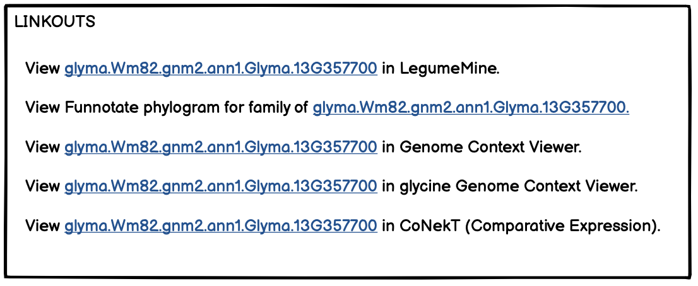

# Pangenes search query - to find ~paralogous/allelic genes (corresponding by homology and synteny)

This is the requirements doc for the LIS, SoyBase, and PeanutBase pangenes search, to be implemented on the respective Jekyll web sites. This search component should enable search of corresponding genes (genes from different accessions), via pangene membership. The primary link targets are those relevant for genes (probably the same as for the gene search).

## Specification version
Version: 0.9.0

This specification was completed in late July, 2023. The specification preceded availability of the data in the mines, so additional review and revision of the spec may be needed before the first implementation.

## Input

- Genus (selector with "any" on top. For SoyBase, only Glycine; for PeanutBase, only Arachis)
- Species (selector populated if genus specified, otherwise only "any")
- Accession (selector populated if genus and species are specified, otherwise only "any")
- Gene ID (text entry)
- Pangene ID (text entry)

- SEARCH button

Examples are shown below each text input element. (Selectors are self-explanatory.)

### Mockup

 

 

 

## Output

The output will be in a tabular layout, with the following content in each pangene-anchored row:

- The name of the pangene
- If feasible, a count of the genes in this pangene. This would probably require either that the count is stored in e.g. the mine backend, OR that the full pangene is accessed, counted, then filtered if an accession or species is selected.
- Full gene name, linking to modal selector, then gene ID in parentheses, then genus and species, then accession, e.g. 
`    glyma.Wm82.gnm1.ann1.Glyma13g43430.2 (Glyma13g43430.2) Glycine max Wm82`

## Implementation notes

- the query will be a GraphQL query run by a web component, which in turn runs an InterMine path query against LegumeMine.
- the linkouts can reuse those for the gene search component. Specifically:
    - View [glyma.Wm82.gnm2.ann1.Glyma.13G357700] in LegumeMine.
    - View Funnotate phylogram for family of [glyma.Wm82.gnm2.ann1.Glyma.13G357700.]
    - View [glyma.Wm82.gnm2.ann1.Glyma.13G357700] in Genome Context Viewer.
    - View [glyma.Wm82.gnm2.ann1.Glyma.13G357700] in glycine Genome Context Viewer.
    - View [glyma.Wm82.gnm2.ann1.Glyma.13G357700] in CoNekT (Comparative Expression).

