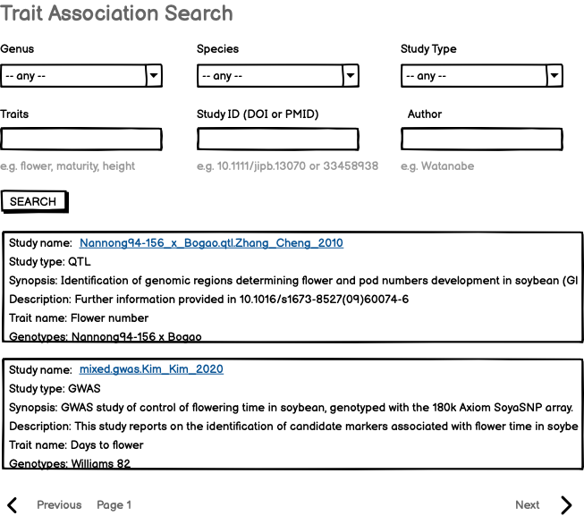
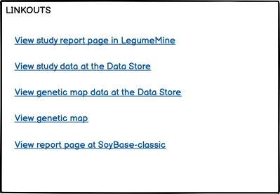

# Gene search query

This is the requirements doc for the LIS, SoyBase, and PeanutBase search, to be implemented on the respective Jekyll web sites.

## Input

- Genus (selector with "any" on top)
- Species (selector populated if genus specified, otherwise only "any")
- Study Type (selector with "any" on top; values GWAS or QTL)
- Traits (text input)
- Study ID (DOI or PMID) (text input)
- Author (text input)
- SEARCH button

Examples are shown below each text input element. (Selectors are self-explanatory.)

### Mockup

 

 

 

## Output

The output will be a paginated list of search results in *vertical display* form, containing:

- Study datastore collection name (linked to Linkout Service) e.g. `Nannong94-156_x_Bogao.qtl.Zhang_Cheng_2010`
- Study type -- either GWAS or QTL
- Synopsis, from datastore collection README, e.g. "Identification of genomic regions determining flower and pod numbers development in soybean (Glycine max L.)"
- Description, from datastore collection README, e.g. "Further information provided in 10.1016/s1673-8527(09)60074-6"
- Trait names, from datastore obo.tsv file or (equivalently) from the mine QTL study, field "Qtls
Trait" or GWAS study, field "Ontology Annotations Term Name", e.g. "Pod number, Plant height"
- Genotypes: e.g. `Jiyu69 x SS0404-T5-76` (QTL) or `809 soybean accessions` (GWAS)

### Mockup

## Implementation notes

- the query will be a GraphQL query run by a web component, which in turn runs an InterMine path query against LegumeMine.
- the linkouts are not specified here -- those are the purview of the Linkout Service specification, which also specifies how they are implemented on web components like this.
